<h2>TKNEWS React</h2>

The project is a news website with a news feed (RSS). In the project, news is presented and published in real-time. You can view news in various categories. Additionally, user login and registration processes are available. The project includes responsive design and a dark mode feature.

<h2>Libs</h2>
<ul>
  <li>React</li>
  <li>Tailwind</li>
</ul>
<h2>USAGE</h2>

1. Fork the repo and then clone it or download it.

2.First install all dependencies:

  <storng>npm install</storng> (with npm)  
  <storng>yarn</storng> (or with yarn)

  

<a href="https://github.com/Tarikkkoc/tknews-nodejs/tree/main">
3. Fork the backend by reading the README file.
</a>

4. Start the server

npm start [OR] yarn start

  

5. Now run the app

localhost:3000

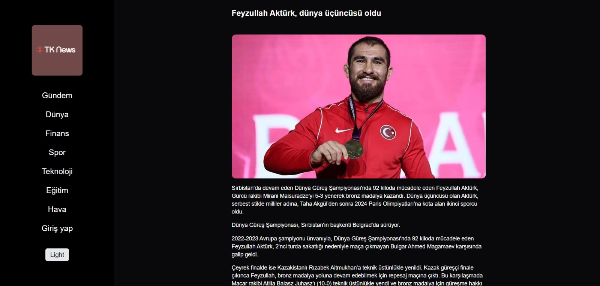
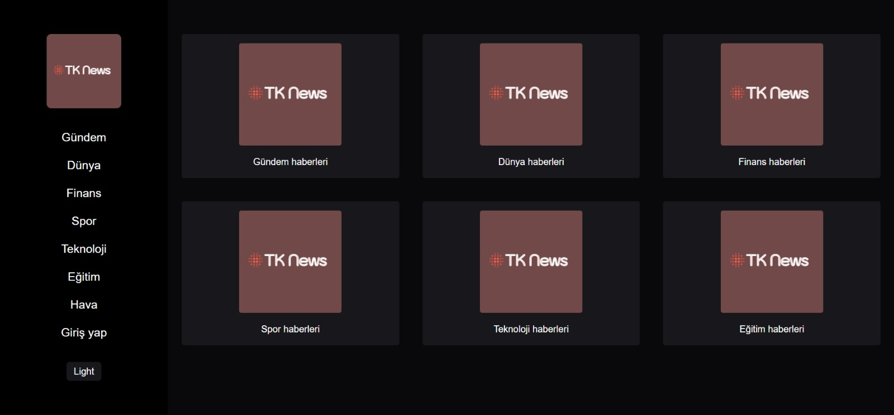
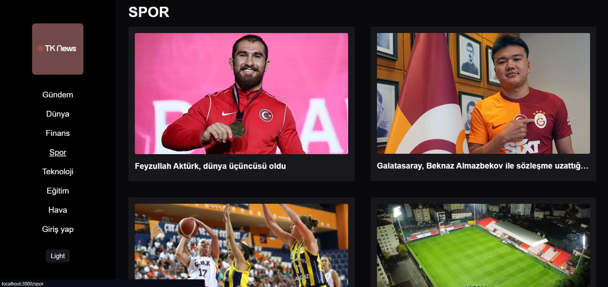
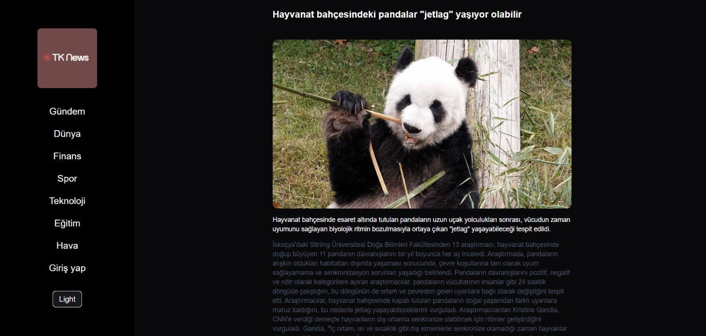
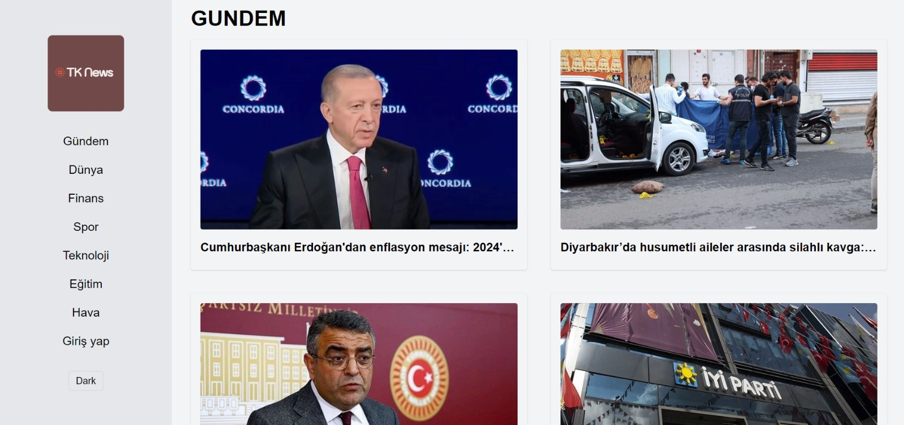
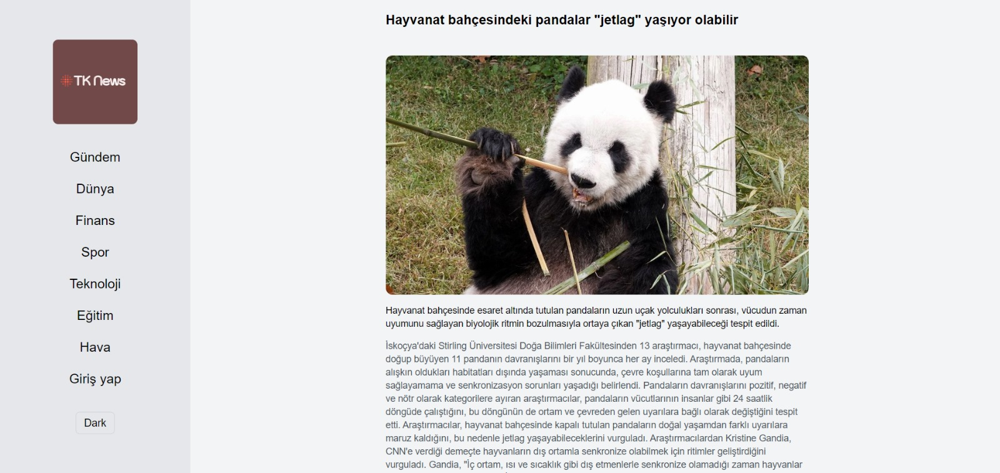
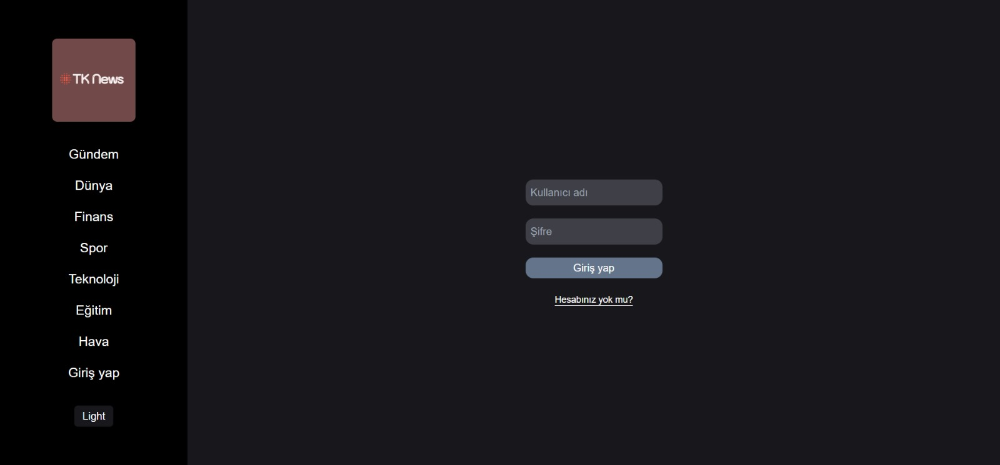
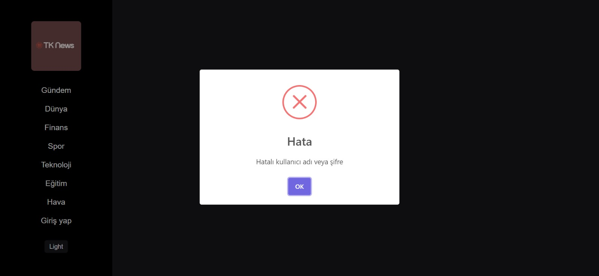

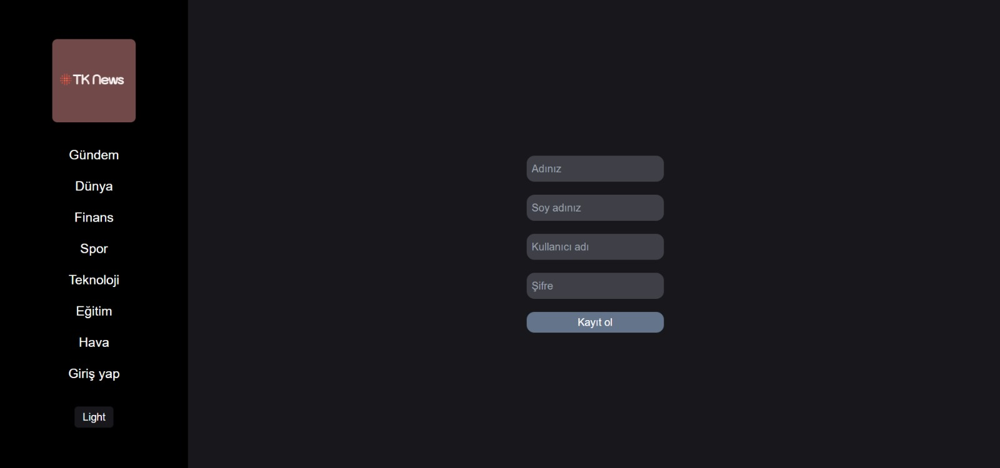
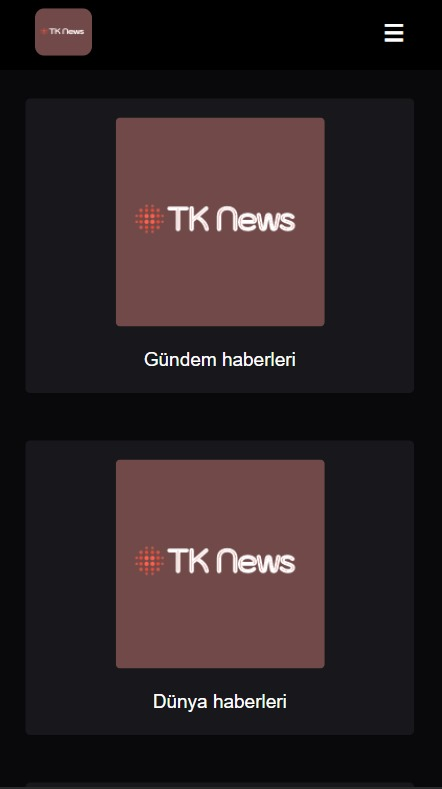
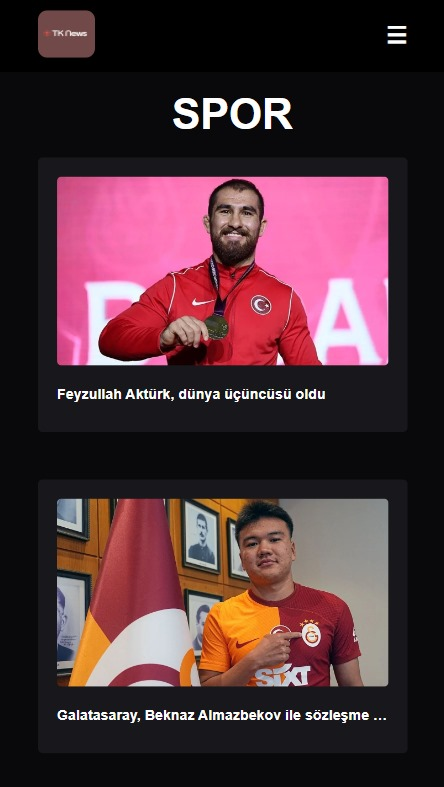

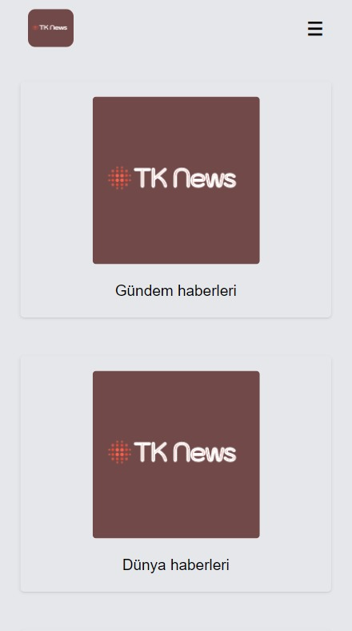
